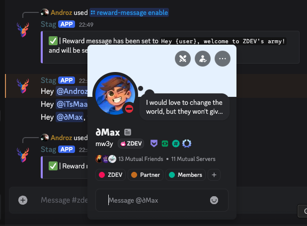

# Stag

Stag is a Discord bot that helps you grant roles and reward your members when they set their tags to your server.

**[Use the hosted version at stagbot.net](https://stagbot.net)**.

## Installation

- fill the .env
- run docker compose up -d
- you're all set!

Sublyna.
